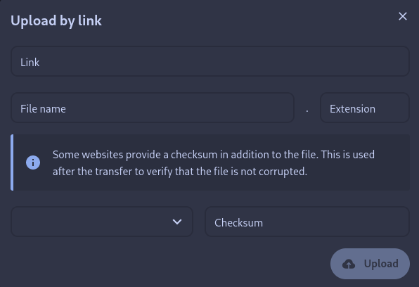

# Nextcloud Transfer app

"Upload by link" functionality for Nextcloud. Transfer files using the full
bandwidth available to your server. Avoid the need to leave your own device
online to finish an upload.

## Usage instructions

Select "Upload by link" from the new file menu.

A prompt will appear for you to paste the link. The file name and extension are
detected automatically when possible, but can be changed.

Once you click "Upload", the transfer will be queued to run in the background.

Queued jobs should start within five minutes. If you want to reduce this delay,
configure your server to trigger `cron.php` more often.

## Development information

### Translations

You can help to translate the app by joining the
[Nextcloud team on Transifex](https://www.transifex.com/nextcloud/nextcloud/).

### Building the app

The app can be built using the provided Makefile by running `make`.
This requires the following programs to be installed:

* `make`
* `tar`: for building the archive
* `npm`: for building the JavaScript bundle

### Publishing

1. Run `make dist`
2. Upload to GitHub releases
3. Sign the file using `openssl dgst -sha512 -sign /path/to/signing.key /path/to/app.tar.gz | openssl base64`
4. Paste download link and signature into the [App Store](http://apps.nextcloud.com/)
